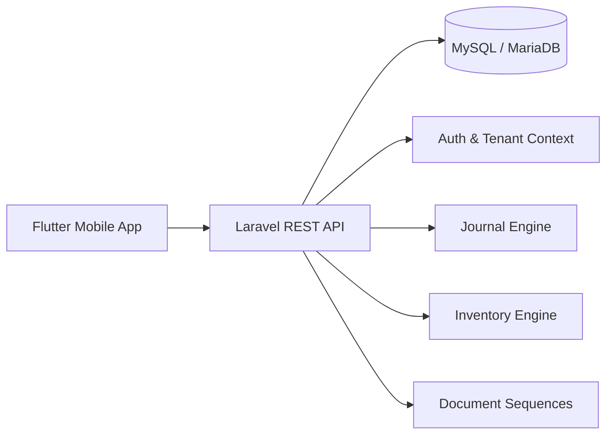

# ERP SKALA UMKM — Public Engineering Showcase

> A mobile-first ERP concept for Indonesian micro, small, and medium businesses, built around POS, inventory, finance, CRM, HRM, and payroll workflows.


## Important Notice

This repository is a **public showcase repository**, not the full production source code.

It contains curated documentation, architecture notes, selected sanitized code examples, sample API contracts, and demo-oriented materials created to demonstrate product thinking, system design, and implementation capability.

The private production repositories contain the actual application source code, deployment configuration, secrets, database migrations, and operational files.

## Why this project exists

Many Indonesian MSMEs still manage sales, stock, cash flow, customer orders, and payroll using separate notebooks, spreadsheets, WhatsApp messages, or memory. This creates common business problems:

- stock differences are detected too late,
- sales are recorded but profit is unclear,
- business money mixes with personal money,
- customer receivables are hard to track,
- payroll records are not connected to finance,
- business owners cannot see a simple operational summary.

ERP SKALA UMKM explores how a small business ERP can be simplified into a mobile-first workflow that is practical for daily use.

## Product Scope

ERP SKALA UMKM is designed around four core pillars:

| Pillar | Scope |
| --- | --- |
| POS & Inventory | Sales draft, posting, receipt, product stock, stock movement, inventory adjustment |
| Accounting & Finance | Cash accounts, income/expense, cash book, simple profit/loss, journal engine |
| CRM | Customer records, customer orders, down payment, receivables |
| HRM & Payroll | Employee records, payroll runs, salary payment |

## Technology Stack

| Layer | Technology |
| --- | --- |
| Mobile App | Flutter, Dart, Riverpod, GoRouter, Dio |
| Backend API | Laravel 12, PHP 8.3 |
| Database | MySQL/MariaDB |
| Architecture | API-first, multi-tenant, role-based access |
| Deployment | VPS-based deployment, Nginx, PHP-FPM |
| Documentation | Blueprint, ADR, demo script, regression checklist |

## Architecture Overview



## Main Design Decisions

- Mobile app first because many MSME owners and staff are more comfortable operating from a phone.
- Manual transaction input first; OCR/AI can be added later as an acceleration layer.
- API-first backend so the same backend can support mobile app, future web admin, and integrations.
- Multi-tenant database model to support multiple businesses safely.
- Business workflows are posted through controlled transaction steps instead of direct table manipulation.

More details are available in [`docs/architecture.md`](docs/architecture.md).

## Selected Features Demonstrated

- Login and business selection
- Dashboard summary
- POS cart and sale posting
- Receipt display
- Product and stock visibility
- Cash book and finance summary
- Customer order and down payment flow
- Payroll run and salary payment summary
- Multi-tenant API structure
- Business-oriented documentation and regression testing

## Demo Materials

Add your public demo materials here:

- Live demo: `https://skalausaha.id`
- API demo: `https://api.skalausaha.id`
- Walkthrough video: `TODO: add video link`
- Screenshots: [`assets/screenshots`](assets/screenshots)

## Repository Structure

```text
erp-skala-showcase/
├── README.md
├── LICENSE
├── NOTICE.md
├── SECURITY.md
├── docs/
│   ├── case-study.md
│   ├── architecture.md
│   ├── demo-script.md
│   ├── public-repo-sanitization-checklist.md
│   └── roadmap.md
├── sample-api/
│   └── openapi-sample.yaml
├── sample-data/
│   └── demo-business.json
├── selected-code/
│   ├── flutter/
│   │   └── pos_cart_controller.sample.dart
│   └── laravel/
│       └── SalePostingService.sample.php
└── assets/
    ├── screenshots/
    └── diagrams/
```

## Portfolio Positioning

This project is useful for demonstrating:

- Flutter mobile application development
- Laravel API development
- API-first product architecture
- business workflow modeling
- multi-module ERP thinking
- practical documentation discipline
- end-to-end product execution from idea to MVP

## What is intentionally not included

For security and product protection reasons, this repository does not include:

- production source code,
- `.env` files,
- deployment scripts,
- database dumps,
- real credentials,
- real customer/business data,
- private roadmap details,
- infrastructure configuration,
- full database schema.

## Author

Built by **Erastmedia ID**  
Portfolio: `https://erastmedia.site`  
Project domain: `https://skalausaha.id`

