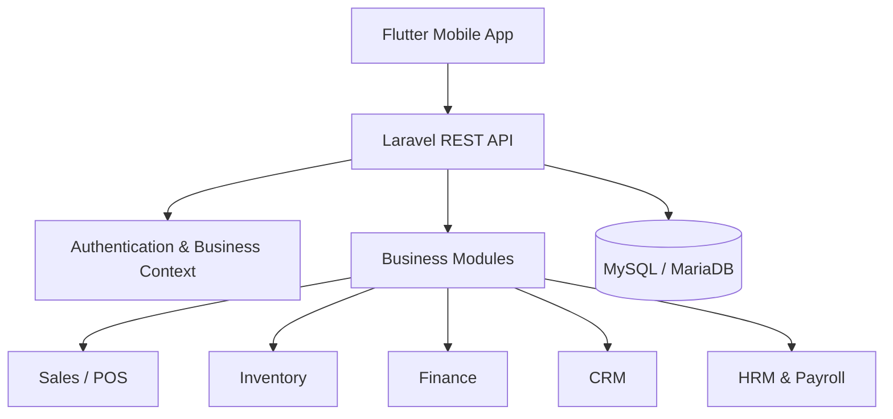
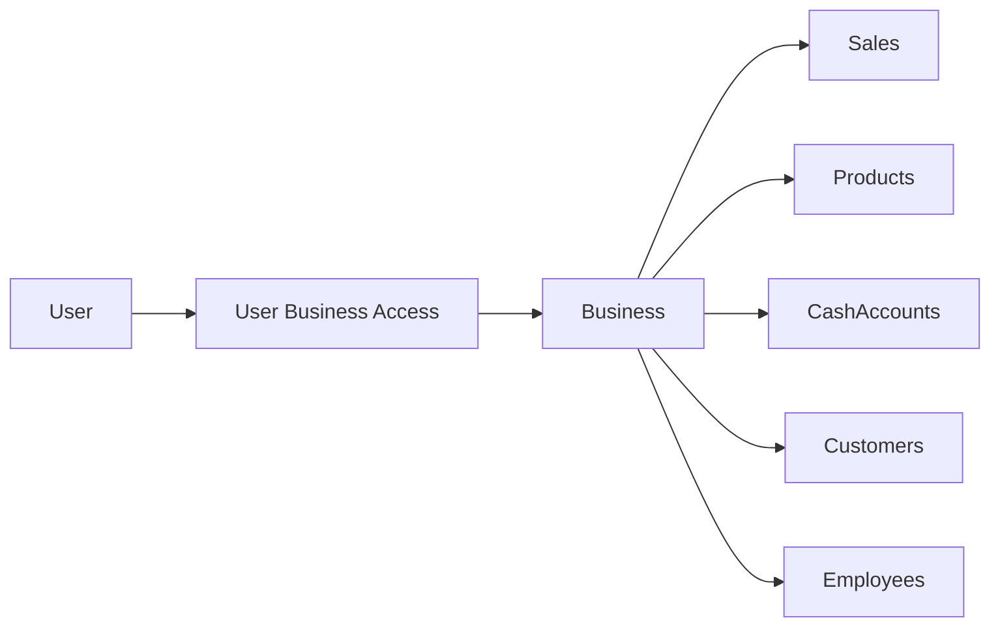
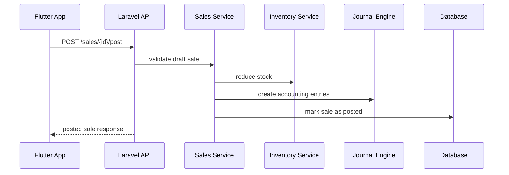

# Architecture Overview

## Architecture Style

ERP SKALA UMKM uses an API-first architecture:



## Main Components

### Flutter Mobile App

The mobile app is the primary user interface for business owners and staff.

Key responsibilities:

- authentication,
- business selection,
- POS cart interaction,
- product and stock browsing,
- finance summary,
- customer order visibility,
- payroll summary,
- mobile-friendly workflow validation.

### Laravel API

The backend contains business rules and workflow orchestration.

Key responsibilities:

- tenant-aware data access,
- authentication,
- authorization,
- transaction posting,
- stock movement,
- journal creation,
- receivable/payable handling,
- payroll posting,
- API response formatting.

### Database

The database stores operational records such as products, stock movements, customers, sales, purchases, cash transactions, employees, and payroll records.

## Multi-Tenant Model

Each business has isolated operational data.

Conceptual model:



The backend should never trust business identifiers directly from the client without checking user access.

## Posting Flow Example

A sale starts as a draft. Posting it turns the draft into an official business transaction.



## Why Manual First

Manual-first does not mean low-tech. It means the core business system must work before automation is added.

Planned future flow:


Manual entry remains important because OCR/AI can make mistakes and business transactions must be reviewable.

## Backend Pattern

A simplified backend service pattern:

```text
Controller
  -> Form Request Validation
  -> Tenant / Authorization Check
  -> Application Service
  -> Database Transaction
  -> Domain-specific Posting Logic
  -> API Resource Response
```

## Mobile Pattern

A simplified Flutter feature pattern:

```text
feature_name/
├── data/
│   ├── models/
│   ├── repositories/
│   └── services/
├── presentation/
│   ├── screens/
│   ├── widgets/
│   └── controllers/
└── domain/
```

## Key Trade-offs

| Decision | Reason |
| --- | --- |
| Mobile-first | Easier for MSME daily usage |
| API-first | Future web admin and integrations become easier |
| Manual-first | Business correctness before automation |
| Multi-module MVP | ERP value comes from connected workflows |
| UX polish after core stability | Avoid beautifying unstable workflows too early |
